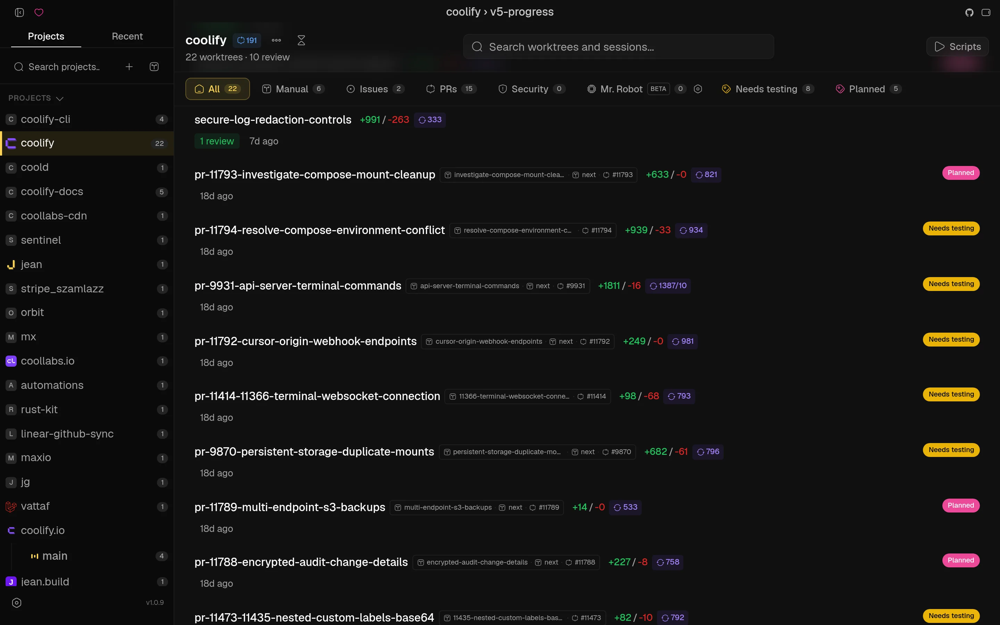
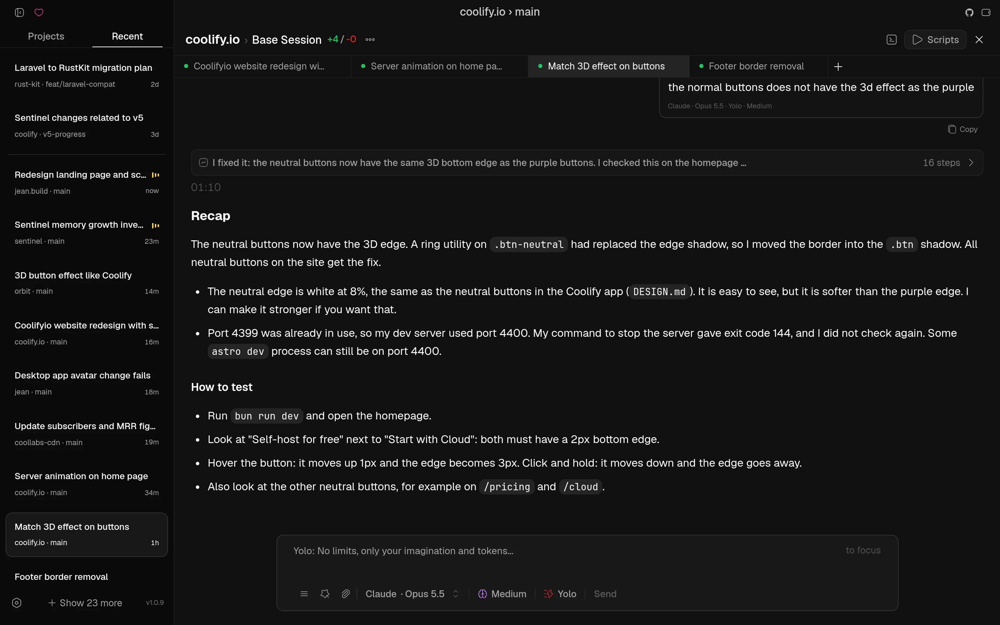
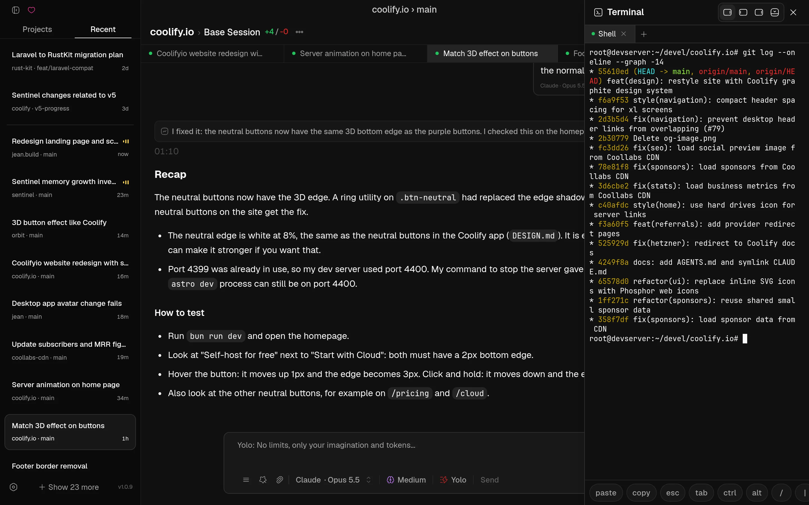
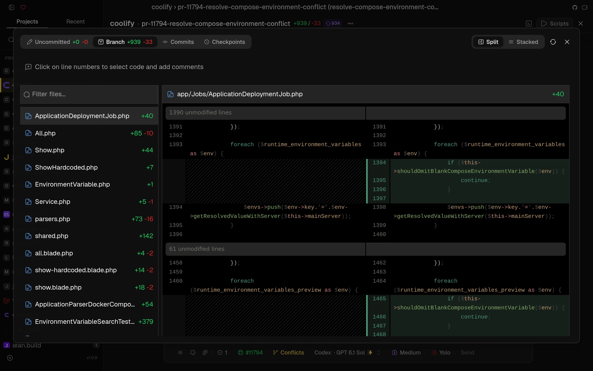
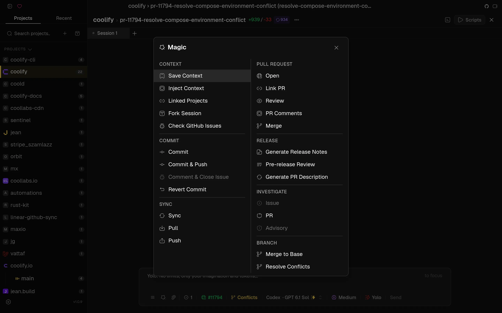
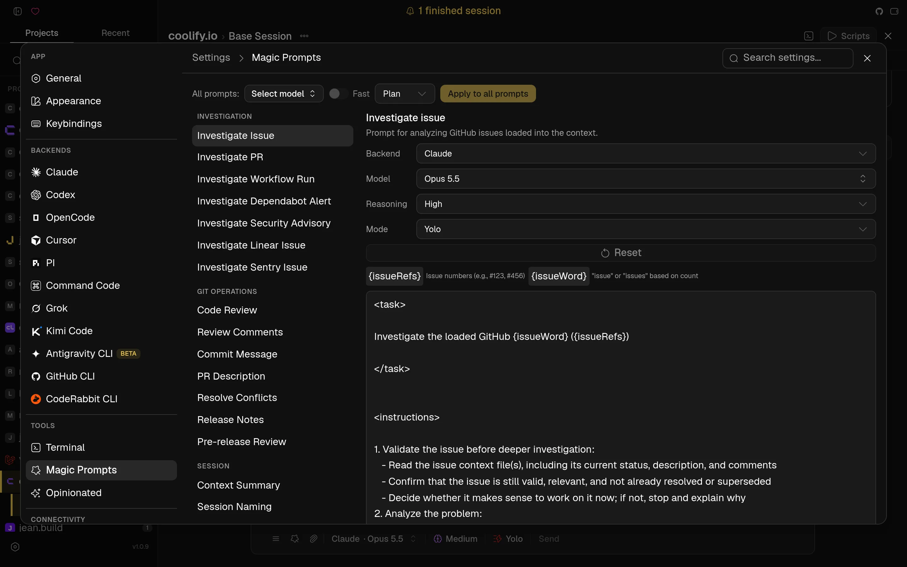
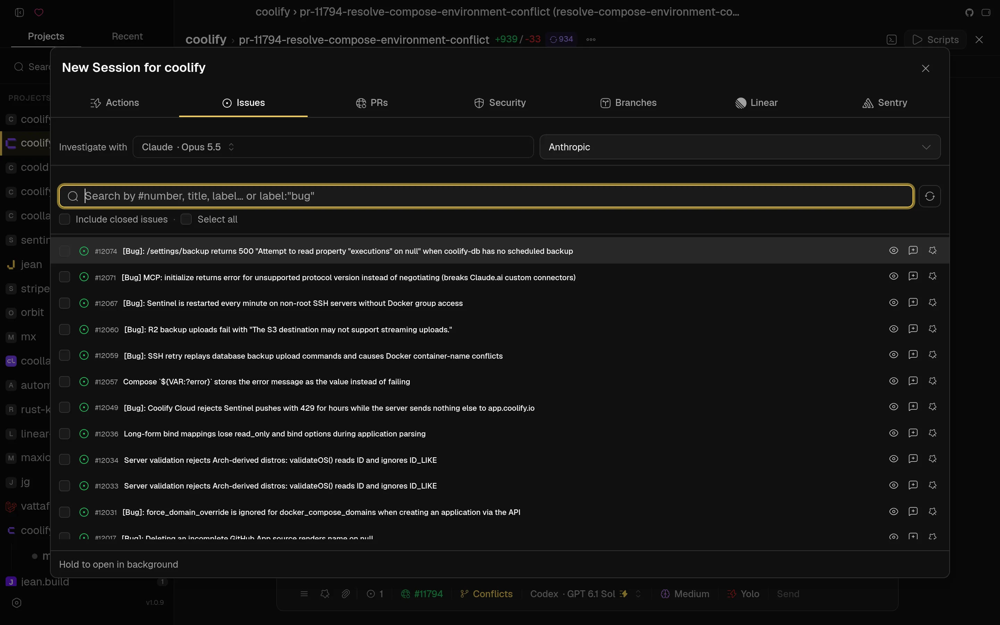

<div align="center">

# Jean

A dev environment for AI agents. Run Claude, Codex, Cursor, OpenCode, Pi, Command Code, Grok, Kimi Code, and Antigravity in parallel - each in its own git worktree - on your laptop or your own server.

Tauri v2 · React 19 · Rust · TypeScript · Tailwind CSS v4 · shadcn/ui v4 · Zustand v5 · TanStack Query · Pierre Diffs · xterm.js

</div>

## About the Project

Jean is an opinionated AI agent workspace. It has strong opinions about how AI-assisted development should work: every task gets its own git worktree, agents run in parallel, and git work, reviews, terminals, and GitHub, Linear, and Sentry integrations live in one cohesive workflow.

Run it as a native desktop app, as a headless `jean-server` on Linux, or both: the desktop app shows local and remote projects together in one sidebar, grouped by server.

No vendor lock-in. Jean uses your own CLI installations and subscriptions, and everything runs on machines you control.

For more information, take a look at [jean.build](https://jean.build).

## Screenshots

<p align="center"></p>

<table>
<tr>
<td><br /><sub><b>Recent sessions & parallel agents</b></sub></td>
<td><br /><sub><b>Built-in terminal</b></sub></td>
</tr>
<tr>
<td><br /><sub><b>Diff review with line comments</b></sub></td>
<td><br /><sub><b>Magic commands</b></sub></td>
</tr>
<tr>
<td><br /><sub><b>Magic prompts</b></sub></td>
<td><br /><sub><b>Start from an issue, PR, Linear or Sentry</b></sub></td>
</tr>
</table>

## Features

- **Project & Worktree Management** - Multi-project support, linked projects for cross-project context, git worktree automation (create, archive, restore, delete), worktree labels and filters, custom project avatars
- **Session Management** - Multiple sessions per worktree, Recent tab across all projects, execution modes (Plan, Build, Yolo) with plan approval flows, `/goal` tracking, session recap/digest, saved contexts with AI summarization, archiving with retention settings, recovery, auto-naming, canvas views
- **AI Backends** - Claude, Codex, Cursor, OpenCode, Pi, Command Code, Grok, Kimi Code, and Antigravity (beta). Model selection and thinking/effort levels with per-mode overrides, MCP server support, multi-agent collaboration, file picker & image attachments, chat search, notification sounds, custom system prompts, custom CLI profiles
- **Magic Commands & Prompts** - Investigate issues/PRs/workflows/security alerts, code review with finding tracking, AI commit messages, PR content generation, merge conflict resolution, release notes generation; every prompt is editable with its own backend, model, effort, and mode
- **Mr. Robot (beta)** - Polls open GitHub issues, creates one worktree per issue, drafts a plan, and can execute approved plans
- **Integrations** - GitHub (Issues, PRs, Security Alerts, Advisories, Dependabot, checkout PRs as worktrees, auto-archive on merge), Linear, Sentry, CodeRabbit
- **Developer Tools** - Multi-dock terminal (floating, left, right, bottom), built-in browser (desktop app), command palette, open in editor (Zed, VS Code, VSCodium, Cursor, Xcode, IntelliJ), git operations (status, stash, revert, fetch/merge with conflict detection), diff viewer (unified & side-by-side) with line comments, file browser with preview and editing (`Cmd/Ctrl+Shift+B`), usage and token tracking
- **Opinionated Plugins** - One-click RTK (cuts tool-output tokens 60-90%) and Caveman (terse Claude replies)
- **Local + Remote** - Add any number of `jean-server` instances to the desktop app (or install one over SSH); their projects appear next to your local ones and every action runs on the server that owns the project
- **Web Access** - Every Jean instance (desktop or headless server) can serve the full UI over HTTP/WebSocket with token auth, including on phones
- **Customization** - Themes (light/dark/system), custom fonts, configurable keybindings, mobile swipe gestures

## Installation

Download the latest version from the [GitHub Releases](https://github.com/coollabsio/jean/releases) page or visit [jean.build](https://jean.build).

### Homebrew (macOS)

```bash
brew tap coollabsio/jean
brew install --cask jean
```

### Building from Source

Prerequisites:

- [Node.js](https://nodejs.org/)
- [Rust](https://www.rust-lang.org/tools/install)
- **Windows only**: In the Visual Studio Installer, ensure the **"Desktop development with C++"** workload is selected, which includes:
  - MSVC C++ build tools
  - Windows SDK (provides `kernel32.lib` and other system libraries required by Rust)

See [CONTRIBUTING.md](CONTRIBUTING.md) for full development setup and guidelines.

## Platform Support

- **macOS**: Tested
- **Windows**: Not fully tested
- **Linux**: Community tested (Arch Linux + Hyprland/Wayland)

## Web Access

Every Jean instance can run **Web Access**: an embedded HTTP + WebSocket server
that serves the same UI in a browser. That applies to both:

| Mode | How you get Web Access |
| --- | --- |
| **Native desktop** (macOS / Windows / Linux) | Settings → **Web Access** - enable the HTTP server, set port/bind address, copy the token URL |
| **Headless server** (`jean-server`) | Always on - the process *is* the Web Access endpoint |

Use it to open Jean from another machine on your LAN, a phone/tablet browser,
or a remote host. Token authentication is on by default; keep it enabled for
any non-localhost bind.

### Network access (recommended: Tailscale)

Web Access binds a normal TCP port (default **3456**). For access beyond the
local machine, prefer a private mesh VPN rather than exposing the port to the
public internet:

- **[Tailscale](https://tailscale.com/)** (recommended) - prefer
  `jean-server --host 127.0.0.1` plus `tailscale serve --bg 3456` so the
  browser gets real HTTPS (clipboard and other secure-context APIs work).
  Binding the Tailscale IP directly (`--host tailscale`) is HTTP-only and
  browsers will treat it as an insecure origin.
- Other options: WireGuard, ZeroTier, SSH tunnel, or a reverse proxy with TLS
  in front of `127.0.0.1`

Keep token auth enabled, use a long random token
(`openssl rand -base64 32`), and avoid binding `0.0.0.0` on untrusted networks
unless you also terminate TLS and restrict who can reach the port.

### Desktop app

1. Open **Settings → Web Access**
2. Enable **HTTP server** (optionally turn on **Auto-start**)
3. Set **Port** and **Bind address** (`127.0.0.1` for local only, LAN IP,
   `0.0.0.0`, or your Tailscale IP)
4. Open the shown URL (includes `?token=...`) in a browser, or share it with
   devices that can reach that host

### Local + remote in the desktop app

The desktop app can work with any number of Jean servers at the same time:

1. Open the server menu at the top of the project sidebar → **Connections**
   (onboarding also offers this step)
2. Click **Add remote** and either:
   - **Install via SSH** - enter SSH user, host/IP, and ports; Jean installs
     `jean-server` on that machine for you, or
   - **Existing URL** - paste the Web Access URL and access token
3. Projects from Local and every enabled remote appear together in one sidebar,
   grouped by server. Use the **All servers** filter to focus on one host.

There is no switching: sessions, terminals, file previews, and git actions run
on the server that owns the project. Uncheck **Include in combined dashboard**
to hide a server without removing it.

### Headless server (`jean-server`)

Run Jean as a standalone Linux server with browser Web Access - no desktop
window, GTK, or WebView required. Linux **amd64** and **arm64** only
(glibc + OpenSSL 3; Ubuntu 22.04+ / Debian 12+ recommended).

#### Install (release binary + systemd)

Interactive install (prompts for bind interface + port when a TTY is available):

```bash
curl -fsSL https://raw.githubusercontent.com/coollabsio/jean/main/scripts/install-jean-server.sh | sudo bash
```

Non-interactive (defaults to `127.0.0.1:3456`, or pass `--host` / `--port`):

```bash
curl -fsSL https://raw.githubusercontent.com/coollabsio/jean/main/scripts/install-jean-server.sh | sudo bash -s -- -y
```

Or from a clone:

```bash
sudo ./scripts/install-jean-server.sh --host 127.0.0.1 --port 3456 -y
```

The installer downloads the latest release, installs the binary, writes an env
file (host/port/token), and registers a systemd service. Re-run to upgrade;
existing tokens are preserved unless you pass `--token`.

Common options:

```bash
# Public bind with an explicit token
sudo ./scripts/install-jean-server.sh \
  --host 0.0.0.0 \
  --port 3456 \
  --token "$(openssl rand -base64 32)" \
  -y

# Tailscale-only bind (auto-detect Tailscale IPv4) - recommended for remote use
sudo ./scripts/install-jean-server.sh --host tailscale -y

# Current user only (user systemd unit)
./scripts/install-jean-server.sh --user-install --host 127.0.0.1 -y
```

#### Run manually

```bash
jean-server --host 127.0.0.1 --port 3456
# or with an explicit token:
jean-server --host 127.0.0.1 --port 3456 --token "$JEAN_TOKEN"
```

`--host` accepts `localhost`, presets (`tailscale`, `lan`, `0.0.0.0`, …), or
any IP/hostname to bind only that interface. Docker images are also published
as `ghcr.io/coollabsio/jean-server`.

See [docs/headless-server.md](docs/headless-server.md) for systemd details,
reverse proxies, updates, and security notes.

## Contributing

See [CONTRIBUTING.md](CONTRIBUTING.md) for development setup and guidelines.

## Core Maintainer

|                                                                                                                                                                            Andras Bacsai                                                                                                                                                                             |
| :------------------------------------------------------------------------------------------------------------------------------------------------------------------------------------------------------------------------------------------------------------------------------------------------------------------------------------------------------------------: |
|                                                                                                                                                                                                                                                                                   |
| <a href="https://github.com/andrasbacsai"></a> <a href="https://x.com/heyandras"></a> <a href="https://bsky.app/profile/heyandras.dev"></a> |

## Philosophy

Learn more about our approach: [Philosophy](https://coollabs.io/philosophy/)

## Star History

[](https://star-history.com/#coollabsio/jean&Date)
